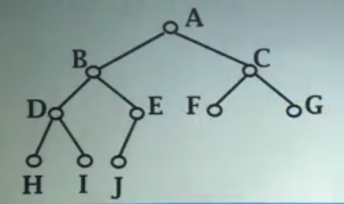

# 相关术语
1. 根节点：最上面的那个节点   叶子节点：没有子节点的节点
2. 子节点、父节点、兄弟节点
3. 边：两个节点的有序对，即从节点A到其子节点B的连接线
4. 祖先、后代：若从节点A有边一直向下连接到节点B，则称A为B的祖先，B为A的子孙
5. 路径：若两个节点之间(祖先、后代关系)有若干条边连接，则经过的节点组成的序列称为路径，路径长度为边的个数
6. 层数：根节点为第0层，其他节点层数为父节点层数＋1
7. 深度：该二叉树下最大的层数，也等于根节点到各个叶子节点的路径长度的最大值
8. 高度：即深度＋1，也等于根节点到各个叶子节点所经过的路径中节点的个数
9. 满二叉树：任何非叶子节点都有两个子节点的树，且只有最底下一排节点才可以是叶子节点
10. 完全二叉树：最多只有一个非叶子节点的子节点数为1，其余非叶子节点数为2，且最下层的节点都集中在最左侧，如下图
		
11. 扩充二叉树：对一个树下所有的节点适当的补充子节点，使原先所有的节点的子节点数为2
12. 度：该节点下子节点的个数

# 二叉树性质
1. 在二叉树中，第i层上最多有$2^i$个节点$(i \geq 0)$
2. 深度为k的二叉树最多有$2^{k+1} -1$个节点。
3. 一个二叉树，若其叶子节点数为$n_0$，度为2的节点数为$n_2$，则$n_2 = n_0 +1$
4. 非空满二叉树树叶数目等于其分支节点数＋1

# 抽象数据类型
对整棵树：

* 初始化二叉树
* 合并两棵树

对节点：
 
* 访问某个节点的左子节点、右子节点、父节点
* 访问节点存储的数据

# 遍历
即系统的访问树中的节点
也相当于将二叉树的节点线性化，之后就可以保存起来

#### 深度优先遍历方法
均从根节点开始

* 前序：访问当前节点，按前序遍历左子树，按前序遍历右子树
* 中序：按中序遍历左子树，访问当前节点，按中序遍历右子树
* 后序：按后序遍历左子树，按后序遍历右子树，访问当前节点

#### 深度优先遍历思想(以中序遍历为例)
* 递归
	1. 以根节点开始访问
	2. 若访问的节点指针不为空，则继续访问其左子树节点，若访问节点指针为空，则返回
	3. 从上一层返回后，读取该节点数据，并访问其右子树节点，并重复步骤2、3
* 非递归（用栈辅助)
	1. 遇到一个节点
	2. 将节点推入栈中，访问其左子节点
	3. 重复步骤2、若左子节点为空则从栈顶弹出节点并访问
	4. 将该节点的右子节点重复步骤1、2、3、4

#### 宽度优先遍历
从根节点开始，自上而下逐层访问，每一层从左至右逐一访问
注意利用队列

# 存储结构
###链式存储
即以链表的形式存储，每一个节点都是一个节点类的实例，每个节点都有左子节点和右子节点的属性。
###线性存储
完全二叉树可以用顺序存储，即将完全二叉树的节点放到一个线性的数组中去。
其中下表为i的节点的左子节点下表为$2*i+1$，右子节点的下表为$2*i+2$
下表为i的节点的父节点下表为$\lfloor{(i-1)/2}\rfloor$
当i为偶数时，其左兄弟下表为i-1
当i为奇数时，其右兄弟下表为i+1

