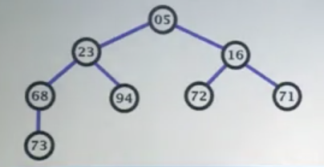

# 堆
堆是一个完全二叉树，一般总用来构造有限队列，并用一个数组来表示
# 最小堆
用二叉树的形式表示就是，节点i上的值小于其左子节点和右子节点的值，并且兄弟节点之间的值没有什么关系
如图

# 堆的关键方法
1. 删除根节点
2. 节点下沉，以上图为例若插入节点值为50
    1. 第一步，先以50为根节点，23和5为左子节点和右子节点
    2. 第二步，找到50节点下的左右子节点相对较小的那个节点，即5，比较50与5点大小，发现50大于5，则将节点50与节点5交换，则此时根节点变成了5，节点50点左右节点为72和71，
    3. 第三步，找到此时50节点下左右子节点的最小值即71，发现50小于71，则节点50的下沉结束，放置到了合适的位置
3. 节点上移，即比较与父节点的大小关系，若小于父节点则与父节点交换即可

# 建立最小堆过程
一般先将所有数据放到一个一位数组中，先组成一个完全二叉树，再从叶子节点从低向上进行调整。
即从下标n/2开始到下标为0的节点进行下沉操作。

# 最小堆的数据操作
### 插入数据
一般会将数据放到数组最后到位置再进行上移操作即可。

### 删除数据
将数组最后一个元素填充到删除的数据的位置后，在判断是否需要进行上移或下沉并进行相应的操作

# 堆的效率分析
建堆的时间复杂度为$O(n)$
插入、删除节点的平均时间复杂度和最差时间复杂度都为$O(log n)$

