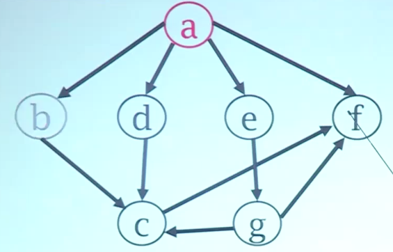

# 术语
#### 完全图
任何两个顶点之间都有边相关联，则称其为完全图

#### 稀疏图
边的条数小于完全图的5%，称其为稀疏图

#### 无向图
两个顶尖之间的边没有方向性，也可以看作是双向的

#### 有向图
顶点之间的边有方向性，一条边只能由一个顶点到另一个顶点

#### 带权图
即每条边都是有权重的，可以表示如时间开销、距离等因素，也成为网络

#### 顶点的度
一个顶点相关联的边的个数，有向图中分为入度和出度

#### 子图
若图A中所有的顶点和边都包含在图B中，则称A是B的子图

#### 路径
一个顶点到另一个顶点所经过的边的有序的集合

#### 有根图
若一个有向图中，存在一个顶点可以到达其它所有顶点，则称此顶点为根，树就是一种有根图

#### 连通
在无向图中，如果顶点a到顶点b有路径，则称其为连通

#### 连通图
在无向图中，若任意两个顶点之间都连通，则称其为连通图

#### 连通分量
连通图中的极大连通子图称为连通分量

#### 强连通
有向图中存在一条路径从顶点a到顶点b，同时还存在一条路径从顶点b到顶点a，则称为强连通

#### 强连通图
若有向图中，任意两个顶点都连通，则称其为强连通图

#### 强连通分量
非强连通图的极大强连通子图称为强连通分量

# 图的储存结构
1. 相邻矩阵，即用一个矩阵来存储，若顶点i,j之间有边，则矩阵位置[i,j]上的值为1，否则为0，这样有n个顶点的图占用的空间为$O(n^2)$
2. 邻接表，对于稀疏矩阵可以采用邻接表方法储存
3. 十字链表，是有向图中的一种链式存储结构

# 图的遍历
### DFS 深度优先遍历

1. 先选取一个节点a作为根节点并访问
2. 递归的遍历节点a的连通节点，即相继访问b、c、f
3. 若访问的节点无连通的节点，则回溯至上一个节点并继续进行步骤2、3，即回溯回c、b、a节点，访问节点d
4. 直到根节点的所有连通节点都访问完毕后，选取其余任意一个未被访问的节点作为根节点开始重新遍历,直到所有节点都被访问

访问结果为a b c f d e g

### 广度优先遍历
1. 先选取一个节点a为根节点并访问
2. 访问与a节点所有的连通节点，即b d e f
3. 再依次访问b d e f节点的所有连通节点并这样一直访问下去
4. 根节点的所有连通节点都访问完毕后，选取其余任何一个未被访问的节点作为根节点重新开始广度遍历，直到所有节点都被访问

访问结果是a b d e f c g

### 拓扑排序
适用于有序无环图的遍历
1. 从图中选择任意一个入度为0的顶点访问
2. 从图中删除掉此顶点及所有的出边，并将出边连接的顶点入度减1
3. 回到第1步，直到所有节点都访问完毕

