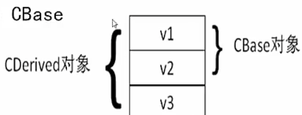

##关于引用
引用就是某一个变量的别名，对引用的操作与之结对变量操作完全一样。且非引用类型返回值不可以直接作为"="运算符左值使用.
##关于inline
* 在类中直接定义并实现的方法 系统自动会判定为 inline 函数
* inline 主要是替代了 C 中宏定义函数的功能
* inline 函数调用时直接用函数体替换掉调用函数的代码，没有参数的入栈出栈，效率很高

##自定义对象数组
<pre>
class A{
};
main(){
	A *p=new A[100];    	//创建100 个对象
	delete []p;     		//[]号 一定要有的
}
</pre>

##关于构造函数/析构函数
####构造函数
* 当函数传递的参数是一个类的对象的时候，函数会调用复制构造函数创建一个临时对象，效率较低，
* 关于类型转换构造函数，如下代码
<pre>
class Complex
{
public:
	double real, imag;
	Complex(int i){		//类型转换构造函数
		real = i;
	};
	Complex(double r,double i){
		real = r;
		imag = i;
	}
	~Complex();
};
Complex c1(7,12);
Complex c2 = 2;
c1 = 9;
</pre>
c2 = 2;  
是直接调用的构造函数  
c1 = 9;  
9会被自动转换成一个临时的Complex对象

####析构函数
* 对象消亡时自动调用的函数，注意在这里调用 delete 去释放 new 出来的空间
* 当对象数组生命周期结束时，对象数组中每个元素的析构函数都会被调用
* 当对象超出作用范围时调用析构函数，包括main函数

##关于static
* 普通成员变量 每个类的对象均含有一份 static成员变量 该类下所有对象共享一份
* 普通成员函数 必须作用于某个对象 static成员函数 不需要作用于某一个对象
* static成员 不需要具体对象便可直接访问   类名::成员名
* 要在定义类的文件中所有函数的外面对静态成员变量进行一次初始化 eg.Person::nTotalCount = 0;
* sizeof 不会计算静态成员变量
* static 目的是将和某些类紧密相关的全局函数和变量写到类里，易于维护和理解
* 注意复制构造函数对static成员变量的影响

##关于运算符重载
目的:扩展c++中提供的运算符的适用范围，用于类表示的抽象数据  
####重载运算符
***
eg.作为普通函数来说
<pre>
返回类型 operator操作符(参数1，参数2)

Location operator+(Location &a,Location &b){
    return Location(a.longtitude+b.longtitude,a.latitude+b.latitude);
}
</pre>
作为成员函数会少一个参数
<pre>
class Location {
public:
    Location(double lon,double la){
        longtitude = lon;
        latitude = lai;
    }
    Location operator+(Location &a){
    	return Location(a.longtitude+longtitude,a.latitude+latitude);
    }
    double longtitude;
    double latitude;
};
</pre>  

####重载复制运算符 "="
***
只能重载为成员函数
####重载运算符为友元函数
***
* 成员函数不能满足使用要求  
* 普通函数又不能访问类的私有成员   

####++/--运算符的重载
***
* 前置运算符  
成员函数：  
T operator++();  
T operator--();  
全局函数  
T operator++(T);  
T operator--(T);  
++obj,obj.operator++(),operator++(obj)都会调用上述函数
* 后置运算符  多写一个参数，具体无意义,编译器会自动编译成0  
成员函数  
T operator++(int);  
T operator--(int);  
全局函数  
T operator++(T,int);  
T operator--(T,int);
obj++,obj,operator++(0),operator++(obj,0)都会调用上述函数 
* 强制类型转换运算符重载  
<pre>
class Demo{
	int n;
	operator int(){
		return n;
	}
}

Demo d;
(int)d;   //d.int()
</pre>
不能写返回值类型，实际上其返回值就是强制类型转换的类型

####iostream 中的运算符重载
"<<" 左移运算符在iostream中进行了重载  
<pre>
osstream & osstream::operator<<(int n)/(const char *s)
{
	......
	return *this;
}
</pre>

####不能被重载的运算符  
***
“.",".*","::","?:",sizeof 以上运算符均不能被重载  
运算符(),[],->,=的重载函数必须声明为类的成员函数

##关于子类
子类对象的内存  
***
子类对象的体积等于父类对象体积再加上子类对象自己的成员变量体积。在子类对象中，包含着父类对象，且父类对象的位置位于子类对象新增成员变量之前。  
  
#####子类的构造函数  
***
执行子类构造函数之前，会先执行父类的构造函数  
显示方式：
<pre>
构造函数名(参数列表):父类名(父类构造函数参数列表){

}
</pre>
隐示方式：  
省略父类构造函数时，会自动调用父类的默认构造函数.  
#####子类的析构函数
***
当子类析构函数被执行时，执行完子类的析构函数，会自动调用父类的析构函数.
##关于虚函数和多态
带virtual关键字带成员函数就是虚函数。  
构造函数和静态成员函数不能是虚函数。  
***
子类对象指针可以赋值给父类的指针（多态）  
但重载的函数为虚函数时，调用函数时仍然调用的是指针指向的对象的类型的函数（子类）.  
当重载的函数不为虚函数时，调用函数时调用的是指针类型对应的函数（父类）.
***
用父类指针数组存放指向各种派生类对象的指针，然后遍历该数组，就能对各个派生类对象做操作。
***
在构造函数和析构函数中调用虚函数，调用的函数是自己的类（若无定义则为父类）中的函数。
***
虚函数表，带有虚函数的对象会自动创建一个指针指向一个虚函数表，表里内容就是指向各个虚函数实现的函数的地址。
***
当父类指针指向子类对象时，delete函数只会调用父类的析构函数，会产生问题。  
可以将父类的析构函数声明为virtual，则可以通过父类指针删除子类对象。  
如果定义了虚函数，最好将析构函数也定义为虚函数。
***
关于父类和子类的成员变量  
在父类中，有virtual修饰的虚成员变量，在子类中有与其同名同类型的成员变量。此种情况下，子类变量会覆盖父类变量。  
在父类中，存在有与子类同名同类型的成员变量，但没有virtual修饰。
此时不会覆盖，但是会重写。即子类中访问成员变量时，访问的是子类的，父类的会被隐藏。但是通过父类名直接调用仍可以使用父类该变量。不属于覆盖，被称为重写。