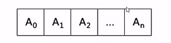
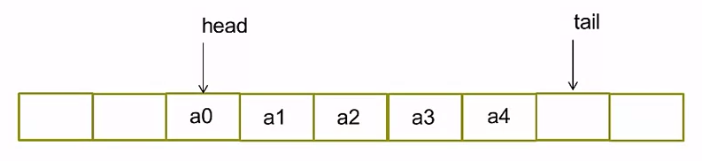
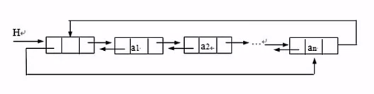
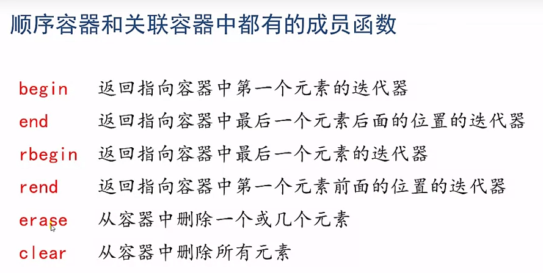
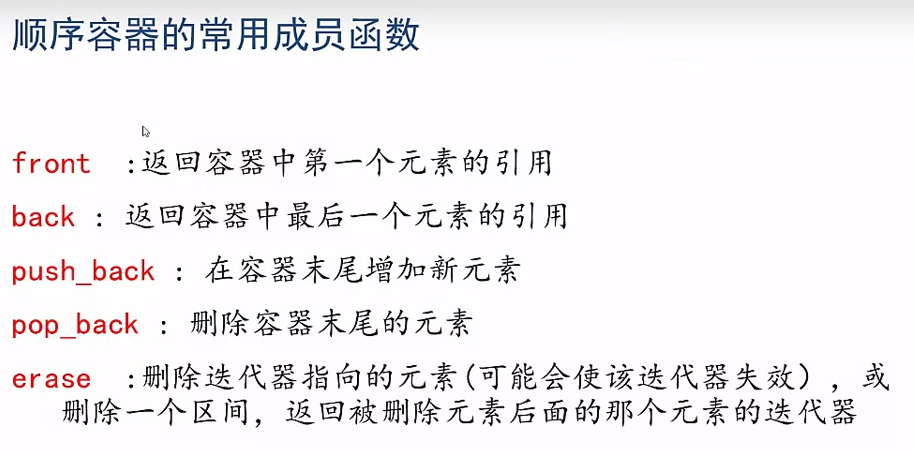
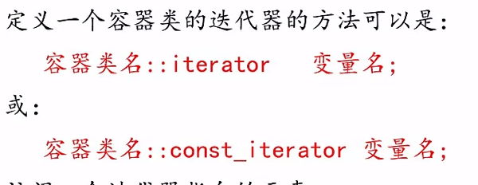

##STL基本概念
容器：可容纳各种数据类型的通用数据结构，是模版类  
迭代器：可用于依次存取容器中的元素，类似于指针  
算法：用来操作容器中的元素的模版函数  
*  sort()来对一个vector中的数据进行排序  
*  find()来搜索一个list中的对象
##容器
用于存放各种类型的数据，分为  
1. 顺序容器(vector,deque,list)  
2. 关联容器(set,multiset,map,multimap)  
3. 容器适配器(stack,queue,priority_queue)  

在对象被插入容器中时，被插入的是对象的一个复制品，所以放入容器的类往往需要重载 == 和 < 运算符  
##顺序容器
###Vector  头文件\<vector>
动态数组，元素在内存连续存放。随机存取任何元素都能在常数时间完成，在尾端增删元素有较高性能(大部分为常数时间)。  
  
开始会开辟一个大容量数组进行操作，当添加的数据量大于vector的长度时，会开辟一个更大数组并将原先的数据拷贝进来，所消耗掉的时间复杂度为O(N)
###deque 	头文件\<deque>
双向队列，元素在内存连续存放，在两端增删元素具有较高性能(大部分为常数时间)。  
  
内部情况与Vector一样，都是一个数组，数据从数组中间开始存放，但存在两个指针分别指向队首和队尾，当数据容量大于旧的数组时，会开辟更大的数组并拷贝数据，所消耗的时间复杂度为O(N)
###list 		头文件\<list>
双向链表，元素在内存不连续存放，任何位置的增删可以在常数时间完成，不支持根据下标存取。  
  
##关联容器
元素是排序的，插入任何元素，都是按对应的排序规则来确定其位置，在查找时具有很好的性能，通常以平衡二叉树方式实现，插入和检索时间都是\\(O(\log{N})\\)
###set/multiset		头文件\<set>
set集合，不允许相同元素存在，multiset中允许相同元素存在
###map/multimap		头文件\<map>
multimap允许存在相同的key。
##容器适配器
###stack		头文件\<stack>
栈，后进先出，即能够操作的数据项只能是最近添加进去的项（栈顶）
###queue		头文件\<queue>
队列，先进先出，插入只能在尾部进行，删除、修改、检索只能从头部进行。
###priority_queue	头文件\<queue>
优先级队列，最高优先级元素总是第一个出列。
##常用函数
  

##迭代器
用来指向顺序容器和关联容器中的元素

